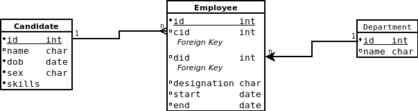

# EMPLOYEE DATABASSE WITH FASTAPI

#### Getting started with FastAPI
This is a sample app to get familier with FastAPI. The aim of the app is to create RESTful web api to connect with a MySQL database and do CRUD operations.


### You should have python3, MySQL and redis installed in your system
And create a database named 'employee_database'

### DB Schema Design



This is the ER diagram of the database schema. Employee table is a one-to-many relation table of Candidate and Department table. Each relation is having delete cascade option, so once a parent object is deleted all its children will be deleted.


## Steps to follow

- Setup and run virtual environment
``` bash
python3 -m venv .env
source .env/bin/activate
```
- Install requirements
``` bash
pip install fastapi
pip install 'uvicorn[standard]'
pip install mysql-connector-python
pip install SQLAlchemy
pip install "python-jose[cryptography]"
pip install "passlib[bcrypt]"
pip install python-multipart
pip install zxcvbn-python
pip install redis
pip install requests
pip install circuitbreaker
pip install celery
pip install yagmail
```
Or run the following code, it will recursively install all the requirements
``` bash
pip install -r requirements.txt
```
After that create ```.env``` file inside auth folder and save the following values there
```.env
SECRET_KEY = $$Your_SeCRet_kEY$$
ALGORITHM = <Your hashing algorithn>
ACCESS_TOKEN_EXPIRE_MINUTES = time in intiger
```

Now run this code to start the server
``` bash
uvicorn main:app --reload
```
Now run this code to start the redis server for caching
``` bash
redis-server
```
## Technologies Used
* `FASTAPI`
    > As the base web framework

* `MYSQL-CONNECTOR`
    > For connecting with MySQL server

* `SQLAlchemy`
    > ORM to communicate with database

* `Python-Jose`
    > For Token based authentication

* `Python-Multipart`
    > For handinling POST request with Auth-Token in Starlette

* `Passlib`
    > For Password Hashing

* `zxcvbn`
    > For password validation

* `Redis`
    > For caching.


## Folder Structure


```
├── apis
│   ├── candidate.py
│   ├── department.py
│   ├── employee.py
│   ├── __pycache__
│   │   ├── candidate.cpython-310.pyc
│   │   ├── department.cpython-310.pyc
│   │   ├── employee.cpython-310.pyc
│   │   └── user.cpython-310.pyc
│   └── user.py
├── auth
│   ├── authentication.py
│   ├── functions.py
│   └── __pycache__
│       ├── authentication.cpython-310.pyc
│       └── functions.cpython-310.pyc
├── data
│   ├── data_access.py
│   ├── database.py
│   ├── model.py
│   └── __pycache__
│       ├── data_access.cpython-310.pyc
│       ├── database.cpython-310.pyc
│       └── model.cpython-310.pyc
├── dump.rdb
├── main.py
├── meta
│   ├── metadata.py
│   └── __pycache__
│       └── metadata.cpython-310.pyc
├── __pycache__
│   └── main.cpython-310.pyc
├── readme.md
└── requirements.txt

9 directories, 25 files
```